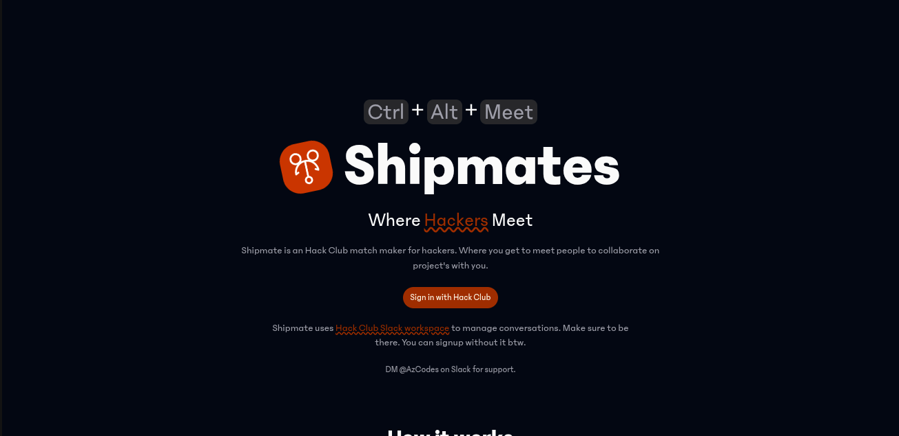

# Welcome to Shipmate

Shipmate is an Hack Club matchmaker for hackers. Where you get to meet people to collaborate on projects with you.



## How it works

1. Signup with Hack Club Auth (HCA)
2. Create a project pitch (what you want to build)
3. Other Shipmates will see your project pitch and if they are interested, they can request to work with you.
4. You can accept or decline their request.
5. If you accept their request, you will be able to chat with them and plan your project on Slack.
6. You can also chat with other Shipmates who are interested in your project on Slack.

## Get Started

Let's get you working on this project.

## Folder Structure

```text
.
|-- client/
|   |-- app/
|   |   |-- components/
|   |   |-- lib/
|   |   |-- routes/
|   |   |-- routes.ts
|   |   |-- root.tsx
|   |-- public/
|   |-- package.json
|-- server/
|   |-- src/
|   |   |-- modules/
|   |   |-- app.module.ts
|   |   |-- main.ts
|   |-- prisma/
|   |   |-- migrations/
|   |   |-- schema.prisma
|   |-- test/
|   |-- package.json
|-- package.json
|-- README.md

```

## Prerequisite

The following are needed for you to run this :

- Nodejs
- PNPM
- A PostgreSQL database

## Installation

This project is a monorepo project which utilizes pnpm workspaces

```bash
pnpm install
```

## Environment Variables

To add environment variables, I've provided `.env.example` file in the `~/server` and the `~/client` folders.

To setup the client:

```bash
cd client
cp .env.example .env
```

To setup the server:

```bash
cd server
cp .env.example .env
```

Those commands will create a `.env` file in the `~/server` or the `~/client` folders and copy the content from the `.env.example` file to the `.env` file.

## Database Setup

You'll need to apply the available migrations to your Postgres Database.

```bash
cd server
npx prisma db push
```

## Running the Project

### Running both client and server at the same time

To run the client and the server at the same time, run the command on the root directory

```bash
pnpm dev
```

This will start up both the frontend and the backend servers

### The `~/client` folder

The client folder contain the frontend code for the application and is build with:

- React Router Remix
- TailwindCSS
- Shadcn

To run the frontend code from use the following command:

From the root folder:

```bash
pnpm client
```

From the client folder:

```bash
pnpm dev
```

### The `~/server` folder

The server folder contain the backend code for the application and is build with:

- Nodejs
- Nestjs
- Prisma ORM
- PostgreSQL database
- Hack Club Auth

To run the backend code from use the following command:

From the root folder:

```bash
pnpm server
```

From the server folder:

```bash
pnpm start:dev
```

## Contributing

Contributing to this project will make it better for other Hack Clubber to use. Feel free to request a PR or raise issues.

## AI Usage Disclosure

I used AI for code generation, code completion, perform redundant task, implement SEO (Search Engine Optimization) and also to help with swagger documentation for the backend API.

## License

Shipmate is licensed under the terms of the [MIT License](./LICENSE).

**Built by teens for teens**
